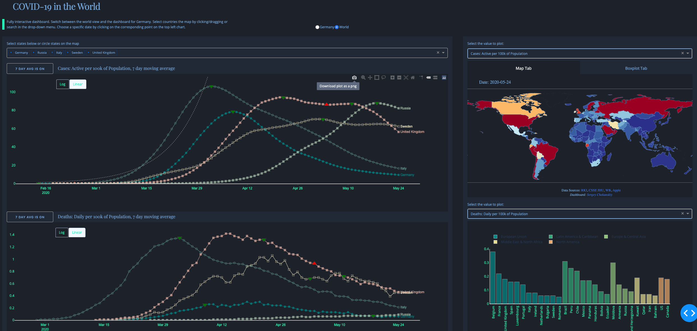
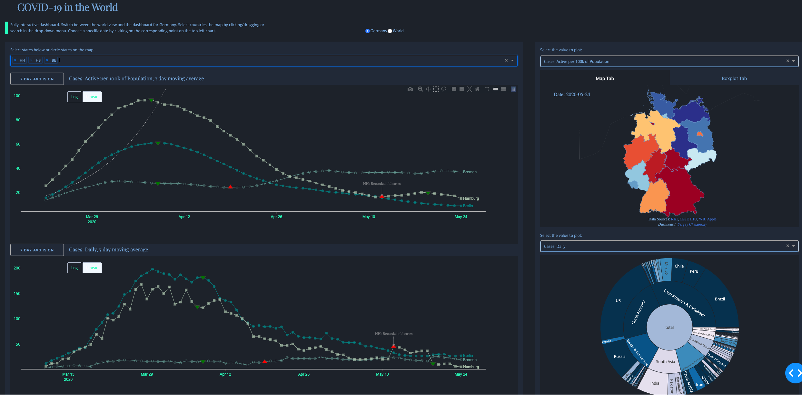

# Fully Dynamic Dashboard
exploring COVID-19 in Germany and the World

* app.py contains app layout and callbacks
* chart...py files contain plotly charts 
* assets/main.css contains most styles
* data/ contains the data files

Data Sources:
* <a href='https://www.rki.de/'>Robert Koch Institute</a> 
* <a href='https://www.apple.com/covid19/mobility'>Apple</a> 
